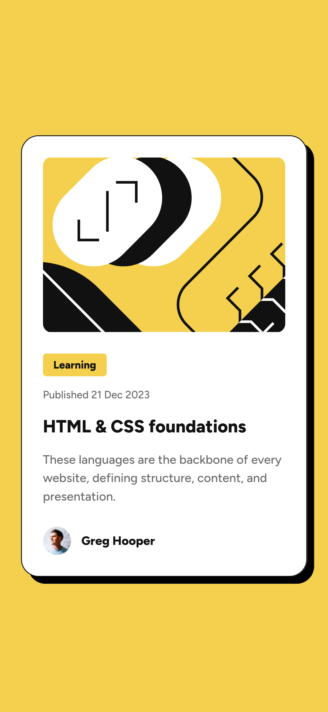

# Frontend Mentor - Blog preview card solution

This is a solution to the [Blog preview card challenge on Frontend Mentor](https://www.frontendmentor.io/challenges/blog-preview-card-ckPaj01IcS). Frontend Mentor challenges help you improve your coding skills by building realistic projects.

## Table of contents

- [Overview](#overview)
  - [The challenge](#the-challenge)
  - [Screenshot](#screenshot)
  - [Links](#links)
- [My process](#my-process)
  - [Built with](#built-with)
- [Author](#author)

## Overview

### The challenge

Users should be able to:

- See hover and focus states for all interactive elements on the page

### Screenshot

|               Mobile                |                Desktop                |
| :---------------------------------: | :-----------------------------------: |
|  |  |

### Links

- Solution URL: [GitHub](https://github.com/aleksey-kerkin/blog-preview-card)
- Live Site URL: [GitHub Pages](https://aleksey-kerkin.github.io/blog-preview-card/)

## My process

### Built with

- HTML5
- SCSS
- BEM

## Author

- Frontend Mentor - [@aleksey-kerkin](https://www.frontendmentor.io/profile/aleksey-kerkin)
